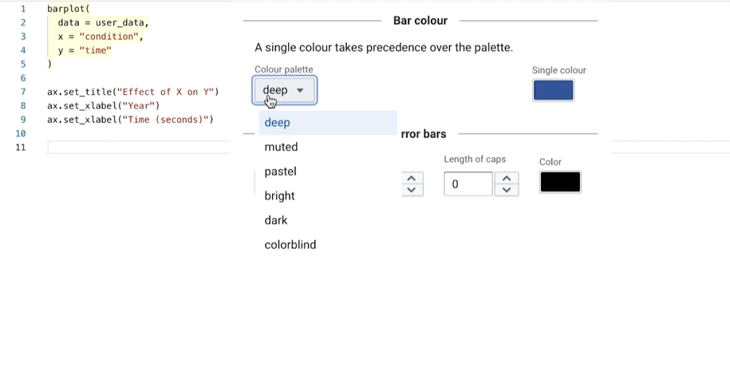

# Lorgnette

Lorgnette is a framework for augmenting code editors with _malleable code projections_, i.e., alternative representations that are bidirectionally linked to pieces of code (or even runtime data!) and can be created and modified by the users of the code editor.
Lorgnette is a research prototype, currently targeting code editors that run in webpages, such as the [Monaco editor](https://microsoft.github.io/monaco-editor/) and [CodeMirror](https://codemirror.net/).

## Usage

TODO.

## Development

TODO.

## Publication and credit

Lorgnette was developed by Camille Gobert as part of his Ph.D. in the [ex)situ](https://ex-situ.lri.fr/) team (Paris-Saclay University, CNRS, Inria, Laboratoire Interdisciplinaire des Sciences du Numérique).
You can read more about Lorgnette in the following publication:

> [**Lorgnette: Creating Malleable Code Projections**](https://doi.org/10.1145/3586183.3606817)
> Gobert & Beaudouin-Lafon, published at the UIST 2023 conference.

To cite Lorgnette, please cite the publication!

## License

The code of Lorgnette is released under the MIT license.
You can freely use and adapt it, and we'd be glad to hear about it if you do!

However, keep in mind that the licenses of some of Lorgnette's dependencies may be more restrictive, especially regarding some of the React components used to create user interfaces for projections. If this matters to you, please check the licences of the dependencies listed in [`package.json`](./package.json).
